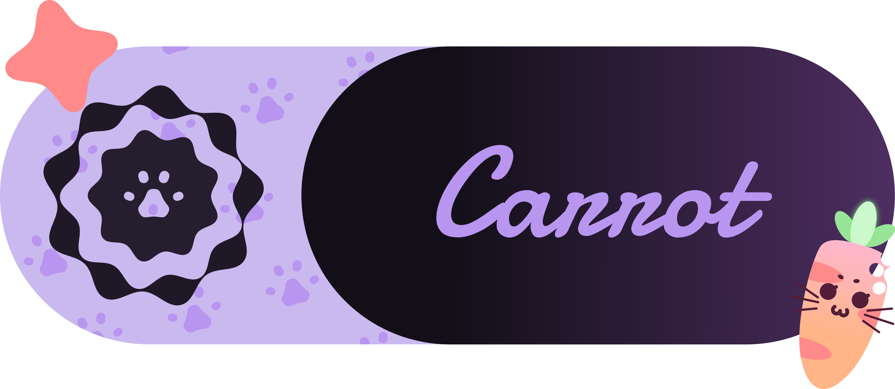

# Carrot  
Welcome to the future of coding!  
This has honestly devolved but still evolved from a UI toolkit to a solid programming lanuage with GUI support!  
Carrot is your interpreter for the lightweight async ready object oriented language Ninjin!  
We have a very good syntax and in our opinion the easiest learning curve, programming has never been any easier!  

# What is {carrot, ninjin, usagi, nekko}?  
This deep naming lore started from the idea of giving this project the codename "NekoEngine" (what? you thought i'd pass up on including "neko" in the name somewhere? :3c)  
Thus NekoEngine sounds close to "Ningine" which is close to the Japanese word for carrot: Ninjin (人参)  
And going further other names derive from Carrot, as for Nekko it's what you'd call a root based plant like carrots in japanese :3 (根っこ)  
What do the names refer to? simple!  
**Carrot** is our interpreter.  
**Ninjin** is the main language.  
**Nekko** is the embeddable interpreter.  
**Usagi** is the compiler.  

# Why is the entire project in one repo?  
You may wonder why the Carrot (interpreter) repo is not part of an organisation and why other components of the Ninjin language also reside here which includes Nekko (embeddable interpreter) and Usagi (compiler)  
We have a couple reasons, first our main brand is the compiler itself, all the other components are side components and rebranding at this point is a bad idea, It doesn't fit if we made a umbrella term for the Ninjin suite in this stage of the development  
As for why we wont separate each component into its own repo then it's mainly to not create a meta repo to hold shared code since the bulk of the project is shared code and managing that would be a nightmare, especially when there's a need to make one tiny edit...  

# RAM を あります か？ 待って。。 いらない わ！  
With our bleeding edge technology we looked at the funny yellow square with 2 letters... *then we burned it and snorted the ashes... the euphoria led us to over-engineer this entire engine written in C++ with our custom interpreted language that easily takes a dump on JS!*  
*Yes we really hate JS... it's just nonesense on top of nonesense!*  
So how RAM efficient is it?  
as efficient as it can be, so long as you write good code that doesn't just fill an array on an infinite while loop qwq  
Carrot and Ninjin are simple by design yet allow you do a lot, this helps us retain our resource claims while providing extensive and extensible ways for developers to use the language  

# So this is just YAUPL (Yet Another Useless Programming Language)?  
Absolutely not!  
Carrot as an engine/interpreter is not just designed to be lightweight but also cross-platform!  
We support Linux and the PS Vita but we made sure that any ports are very easy to make, our codebase is platform separated which means that porting is as simple as editing 3 files!  

# So Ninjin is simple by default but...  
Now now... dont worry!  
Carrot is equipped with an FFI (Foreign Function Interface) to extend the capabilities of Carrot as an engine and Ninjin as a language, you can add your custom logic or even custom types with our C++ API!  
This allows us to create our modular GUI engine plus modularized updateable libraries!  
With the speed of C and the full control over the language the possibilities are endless, really, the sky's the limit!  

# I'm new to Ninjin...  
We got you covered!  
Whether you like reading docs or examples, we got a bit for everyone, this includes for learning Ninjin (the language) or for creating FFI modules for Carrot (the engine/interpreter)  
We're sure that anyone can pick up Ninjin with ease, even if you're new to coding dont let it intimidate you, we made sure our syntax is as easy as possible :3  

# Feeding Neko a Carrot  
I mean... they're not my favourite but... I wont say no to free food >.<  
feeding or supporting or even looking at other things this silly cat does can be done by following [this link :3](https://github.com/NekoMimiOfficial) 
